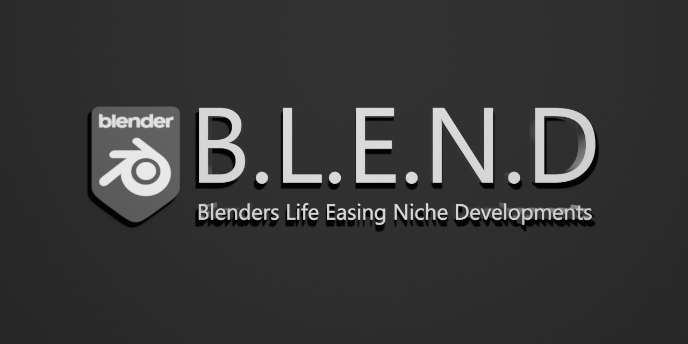

<h1 align="center">B.L.E.N.D</h1>

**Blenders Life Easing Niche Developments or B.L.E.N.D is a series of add-ons for [Blender](https://www.blender.org/) aimed at making life a little easier, solving common issues and generally filling in gaps that should maybe exist by default and adding features from other programs that Blender could do with.**

*This is a free project so please do not anticipate dedicated individual help unless you are supporting me financially. I will help where i can but only when i have the time.*

Check the [Wiki Pages](https://github.com/Jim-Kroovy/B.L.E.N.D/wiki) to find out more about the add-ons and see what's being worked on in the [Github Projects](https://github.com/Jim-Kroovy/B.L.E.N.D/projects)

<h2 align="center">Support Development</h2>

*Please consider supporting financially! More help means more time i can put into updates, new features and support!*

- Donate to an add-on of your choice on [Gumroad](https://gumroad.com/jimkroovy)
- Purchase on Blender Market - Link coming soon...
- Support me on [Patreon](https://patreon.com/JimKroovy) - Gives you higher priority in my discord server for feedback, ideas and support.

If you want to stay up to date on what i'm working on you can also subscribe/follow me on [Youtube](https://www.youtube.com/c/JimKroovy), [Twitter](https://twitter.com/JimKroovy), [Facebook](https://www.facebook.com/JimKroovy/) and [Instagram](https://www.instagram.com/jimkroovy/)
